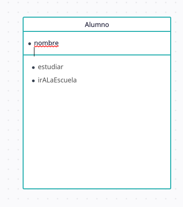

# Preparando el ambiente de desarrollo

- que es un algoritmo
- que significa programar
- que es un lenguaje de programacion de proposito gral
- por qué Python. Caracteristicas de python
- la diferencia entre interprete y compilador
- las herramientas que se requieren para programar: un editor + el interprete de Python
- las extensiones de archivo, que son. Ejemplos: .doc, .txt, etc y las que usa Python .py
- como se usa el interprete
```python:
  >python Clase.py
```

# Conceptos básicos de el PPOO
- que es una clase, sus atributos y metodos
- Usamos un rectángulo de 3 secciones para representar estas clases.
  
  

## Convenciones de nombrado en Python
Las convenciones de nombrado de variables son muy importantes porque nos dan limpieza en el código y un mayor entendimiento del mismo, incluso antes de ir a leer la documentación. Por tal motivo se considera un principio de programación.

En Python y en esta clase usaremos:

- sustantivo para nombres de variables y atributos, empezando con minúscula.
  ``` python
    int edad
    int edadRegistro
    int edad_registro
  ```
- sustantivo para nombres de clases, empezando con Mayúscula
  ``` python
    class Estudiante
    class EstudianteUniversitario
    class Estudiante_Universitario
    EstudianteUniversitario estudiante = EstudianteUniversitario("Adolfo", 35)
  ```
  - verbos para nombres de métodos, empezando con minúscula
  ``` python
    validar()
    validarNombre()
    validar_nombre()
  ```

- nombres de proyectos y paquetes son sustantivos, empezando en minúscula y no llevan espacios
  ``` python
    sistemaInventario
    sistema
  ```  

[Acá se puede leer con más detenimiento](https://peps-python-org.translate.goog/pep-0008/?_x_tr_sl=en&_x_tr_tl=es&_x_tr_hl=es&_x_tr_pto=tc)

## Ejercicios. 
1. Contexto. Restaurant. Identificar 5 clases con atributos y metodos
2. Contexto: sistema de estudiantes de la fac de ciencias.
3. Crear la primer clase Cuenta, con su atributo saldo

