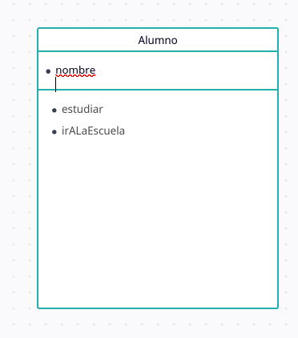

# Preparando el ambiente de desarrollo

- que es un algoritmo
- que significa programar
- que es un lenguaje de programacion de proposito gral
- por qué Python. Caracteristicas de python
- la diferencia entre interprete y compilador
- las herramientas que se requieren para programar: un editor + el interprete de Python
- las extensiones de archivo, que son. Ejemplos: .doc, .txt, etc y las que usa Python .py
- como se usa el interprete
```python:
  >python Clase.py
```

# Conceptos básicos de el PPOO
- que es una clase, sus atributos y metodos
- Usamos un rectángulo de 3 secciones para representar estas clases.
  
  

## Convenciones de nombrado
- nombre de clase. Sustantivo en mayúscula. Ejemplo: Circulo
- nombre de atributo, sustantivo en minúscula. Ejemplo: radio
- nombres de método, verbos, y si se necesitan concatenados con otra palabra donde la primera se mayuscula. Ejemplo: calcularDiametro

## Ejercicios. 
1. Contexto. Restaurant. Identificar 5 clases con atributos y metodos
2. Contexto: sistema de estudiantes de la fac de ciencias.
3. Crear la primer clase Cuenta, con su atributo saldo

